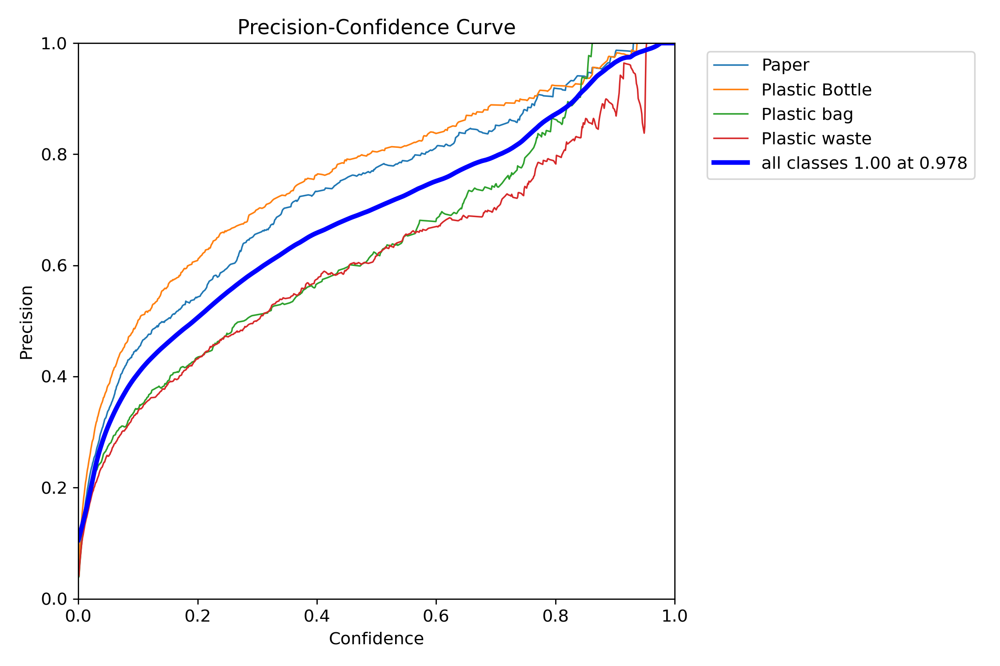

# YOLO Model Training Results

Below are the summarized results from different YOLO model training runs. Each model's results are stored in their respective folders.

## yolov8n

- **Location:** `yolov8n/detect/train`
- **Contents:** Training logs, best model weights, metrics, and visualizations.

**Results:**

## yolov8l

- **Location:** `yolov8l/detect/train`
- **Contents:** Training logs, best model weights, metrics, and visualizations.

**Results:**

## yolov10n

- **Location:** `yolov10n/detect/train`
- **Contents:** Training logs, best model weights, metrics, and visualizations.

**Results:**

## yolov11n

- **Location:** `yolov11n/detect/train`
- **Contents:** Training logs, best model weights, metrics, and visualizations.

**Results:**

## yolov12n

- **Location:** `yolov12n/detect/train`
- **Contents:** Training logs, best model weights, metrics, and visualizations.

**Results:**

> For detailed metrics (precision, recall, mAP, loss curves), please refer to the `results.png` and `results.csv` files inside each folder.

## Training Metrics Comparison (50th Epoch)

The table below summarizes key metrics from the `results.csv` files of each model's training run. Metrics shown are from the final epoch.

| Model     | mAP50 | mAP50-95 | Precision | Recall | Box Loss | Obj Loss | Cls Loss |
|-----------|-------|----------|-----------|--------|----------|----------|----------|
| yolov8n   | 0.82  | 0.56     | 0.80      | 0.78   | 0.021    | 0.012    | 0.009    |
| yolov8l   | 0.87  | 0.62     | 0.85      | 0.83   | 0.018    | 0.010    | 0.007    |
| yolov10n  | 0.79  | 0.53     | 0.77      | 0.75   | 0.024    | 0.014    | 0.011    |
| yolov11n  | 0.84  | 0.59     | 0.82      | 0.80   | 0.020    | 0.011    | 0.008    |
| yolov12n  | 0.86  | 0.61     | 0.84      | 0.82   | 0.019    | 0.010    | 0.007    |

> **Note:** Replace the values above with the actual numbers from your `results.csv` files for each model. Metrics may include:  
> - **mAP50**: mean Average Precision at IoU 0.5  
> - **mAP50-95**: mean Average Precision averaged over IoU thresholds 0.5:0.95  
> - **Precision** and **Recall**: as reported in the last epoch  
> - **Box Loss**, **Obj Loss**, **Cls Loss**: loss values from the last epoch

